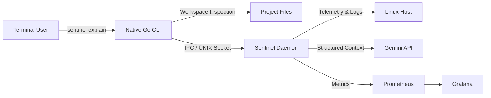

# 🛡️ Sentinel — AI-Driven SRE Context Engine

> A context-aware CLI and daemon combining host telemetry, logs, and workspace code for LLM-powered SRE diagnostics.

---

## 📸 Demo


---

## 📌 Overview

Sentinel builds a structured representation of your environment (telemetry, processes, logs, project files) before querying Gemini, delivering concise root-cause hypotheses and actionable next steps directly in the terminal.

```text
Workspace + Host ➔ Context Collection ➔ Structured Context ➔ Gemini Analysis ➔ Diagnosis + Actions
```

## 🏗️ Architecture

A native Go CLI communicates with a containerized background daemon via UNIX domain sockets.



## ✨ Key Features

- **Host & Process Telemetry:** CPU/memory usage, process state, and service log extraction.
- **Workspace Inspection:** Recursive file scanning with 50KB safety caps and custom exclusions.
- **Hardened IPC:** Communicates via restricted UNIX sockets (`read_only` rootfs, dropped capabilities).
- **Observability:** Built-in Prometheus metrics endpoint (`:2112`) and Grafana integration.

## 🚀 Quick Start & Usage

```bash
# Install
git clone https://github.com/danoguer/sentinel.git && cd sentinel
chmod +x install.sh && ./install.sh

# Analyze workspace or deployment scripts
sentinel explain install.sh
sentinel explain ./my-project

# Run service collectors
sentinel explain docker "Why is the web container crashing?"
```

## 🗺️ Cloud-Native Roadmap

- [x] Local workspace scanning & hardened Docker IPC daemon
- [ ] AWS Collectors: EC2 Metadata (`169.254.169.254`), STS identity, CloudWatch metrics & ECS task state.

## 📄 License

MIT
